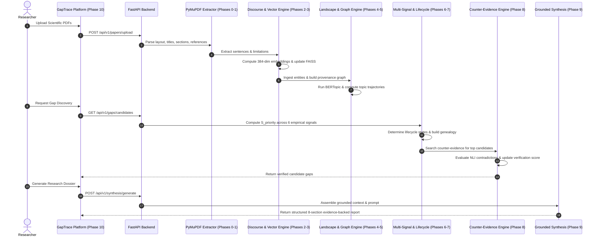

# GapTrace: Complete Algorithmic & System Logic Guide
## An Evidence-Grounded NLP Framework for Temporal Research Gap Discovery and Verification

---

## 1. Project Philosophy & Architectural Principles

### 1.1 The Core Problem in Automated Literature Review
Traditional AI tools for literature analysis suffer from critical flaws:
1. **Superficial LLM Summarization:** Prompting an LLM with *"Find research gaps in these papers"* results in hallucinations, generic recommendations (*"more data is needed"*, *"investigate larger models"*), and recency bias.
2. **Lack of Provenance:** Generic tools cannot prove *which exact sentence* on *which page* of *which paper* established a limitation.
3. **Temporal Blindness:** A limitation raised in a 2018 paper might have been completely solved by a 2021 publication. Without chronological tracking, systems flag already-solved problems as "open gaps."
4. **Absence of Adversarial Verification:** Finding that a paper stated a limitation does not prove the limitation persists today. It must be subjected to an active adversarial counter-evidence search.

### 1.2 The GapTrace Solution
**GapTrace** is designed as a **provenance-grounded, multi-phase scientific NLP framework**:
- The LLM is **not** the gap detector.
- Gap detection, ranking, graph construction, temporal progression, and counter-evidence verification are handled by **deterministic, mathematical, and specialized NLP algorithms**.
- The LLM is invoked **strictly at the final stage (Phase 9)** to synthesize verified, structured facts into academic reports.

```
┌──────────────────────────────────────────────────────────────────────────────────┐
│                             GAPTRACE PIPELINE ARCHITECTURE                       │
└──────────────────────────────────────────────────────────────────────────────────┘
  [Phase 0-1: PDF Parsing & Layout Structure Extraction]
         │ (clean sections, pages, references, metadata)
         ▼
  [Phase 2: Scientific Discourse & Limitation Detection] ── (Rule + Transformer NLP)
         │ (sentence categories, explicit & implicit limitation cues)
         ▼
  [Phase 3: Dense Vector Embeddings & FAISS Retrieval] ── (384-dim all-MiniLM-L6-v2)
         │ (dense similarity, provenance-filtered search)
         ▼
  [Phase 4: Topic Discovery & Longitudinal Trends] ── (BERTopic + UMAP + c-TF-IDF)
         │ (thematic clusters, trajectory classification: Emerging/Persistent/Declining)
         ▼
  [Phase 5: Heterogeneous Provenance Knowledge Graph] ── (NetworkX / Cypher)
         │ (10 node types, 11 discourse relations, k-hop subgraphs)
         ▼
  [Phase 6: Multi-Signal Gap Candidate Generation] ── (Weighted Priority Metric)
         │ (mathematical ranking combining 6 empirical signals)
         ▼
  [Phase 7: Temporal Lifecycle State Machine] ── (6 Finite Automata States)
         │ (chronological trajectory, ancestor-descendant genealogy trees)
         ▼
  [Phase 8: Adversarial Counter-Evidence Verification] ── (Contrastive NLI Retrieval)
         │ (entailment vs contradiction scoring, false-positive pruning)
         ▼
  [Phase 9: Evidence-Grounded LLM Synthesis] ── (Multi-Provider: Gemini/OpenAI/Local)
         │ (structured academic reporting grounded in verified evidence)
         ▼
  [Phase 10: Research Intelligence Dashboard UI] ── (React 18 / Vite / Vanilla CSS)
         │
  [Phase 11: Scientific Benchmark Evaluation] ── (5 Controlled Experiments)
```

---

## 2. Phase-by-Phase Algorithmic & Logical Breakdown

---

### Phase 0 & 1: Document Layout, Structure Extraction & Ingestion

#### Objective
Convert raw scientific PDFs into cleanly structured, schema-compliant records with paragraph-, section-, and page-level provenance.

#### Logic & Heuristics
1. **Layout-Aware PDF Ingestion (`PyMuPDF / fitz`):**
   - Extracts text blocks alongside coordinates $(x_0, y_0, x_1, y_1)$, font names, font sizes, and flags.
   - **Title Detection Heuristic:** Selects the text block on Page 1 having the maximum font size $\max(F_{size})$ that is not an institutional header or copyright block.
   - **Heading vs. Body Classification:**
     - Computes the modal body font size $F_{body}$ across the first 3 pages.
     - A block is classified as a Section Heading if $F_{size} > 1.15 \cdot F_{body}$ or if the font flag indicates `Bold` and the line matches standard numbered section patterns (e.g., `^(\d+\.?\d*)\s+([A-Z].*)`).
2. **Canonical Section Normalization:**
   - Academic section headers vary widely (`"Our Approach"`, `"Model Architecture"`, `"Experimental Setup"`). The system maps headers into 7 canonical types using regular expression trees:
     - `ABSTRACT`: `abstract|summary`
     - `INTRODUCTION`: `introduction|background|motivation`
     - `RELATED_WORK`: `related\s+work|prior\s+literature|state\s+of\s+the\s+art`
     - `METHOD`: `method|model|approach|architecture|formulation|algorithm`
     - `EXPERIMENT`: `experiment|evaluation|results|setup|empirical`
     - `LIMITATION`: `limitation|drawback|threats\s+to\s+validity|failure\s+cases`
     - `CONCLUSION`: `conclusion|future\s+work|discussion|summary`
3. **Reference & Citation Parsing:**
   - Isolates the bibliography block at the tail of the document.
   - Parses references into `(reference_index, title, authors, year, raw_string)` via regex matching standard citation formats (e.g., `[1] Vaswani et al., 2017`).
4. **Database Ingestion Schema:**
   - PostgreSQL / SQLite dev fallback with tables: `papers`, `paper_sections`, `paper_references`.

---

### Phase 2: Scientific Discourse Parsing & Limitation Detection

#### Objective
Segment raw sections into grammatical sentences and classify their academic rhetorical role, isolating explicit and implicit research limitations.

#### Logic & Heuristics
1. **Scientific Sentence Boundary Detection:**
   - Standard sentence splitters break on academic abbreviations (`et al.`, `i.e.`, `e.g.`, `Fig. 3`, `Eq. 4`).
   - The engine uses a custom regex token guard to protect abbreviations before applying boundary splitting:
     $$\text{Pattern: } (?<!\b(?:et al|i\.e|e\.g|Fig|Eq|Ref|Vol|pp|vs|Dr|Prof))\.\s+(?=[A-Z0-9“\"'\(])$$
2. **Discourse Role Classification:**
   Each sentence is assigned a primary rhetorical label $D \in \{\text{BACKGROUND}, \text{OBJECTIVE}, \text{METHOD}, \text{RESULT}, \text{LIMITATION}, \text{FUTURE\_WORK}\}$ based on hybrid rules and transformer classification:
   - **Lexical Cue Patterns:**
     - *Objective:* `"we propose"`, `"this paper introduces"`, `"our goal is"`
     - *Method:* `"we train"`, `"hyperparameters were set"`, `"we optimize"`
     - *Result:* `"achieves state-of-the-art"`, `"outperforms baseline by"`, `"Table \d+ shows"`
     - *Future Work:* `"in future work"`, `"we plan to explore"`, `"remains an open avenue"`
3. **Limitation Detection Engine:**
   Limitations are categorized into two types:
   - **Explicit Limitations:** Triggered by negative polarity markers combined with boundary keywords:
     $$\text{Explicit Cue: } \text{Hedge}(\text{"however"},\text{"although"},\text{"unfortunately"}) + \text{Defect}(\text{"fails"},\text{"degrades"},\text{"prohibitive"},\text{"bottleneck"})$$
   - **Implicit / Boundary Limitations:** Conditional constraints on applicability:
     $$\text{Implicit Cue: } \text{"only evaluated on"},\text{"restricted to small-scale"},\text{"quadratic complexity"},\text{"assumes noiseless"}$$
4. **Limitation Extraction Confidence Score:**
   $$C_{lim} = \sigma\left(\alpha \cdot \text{TransformerScore} + \beta \cdot \text{CueWeight} + \gamma \cdot \mathbb{I}_{\text{InLimitationSection}}\right)$$
   where $\alpha = 0.55, \beta = 0.30, \gamma = 0.15$. If $C_{lim} \ge 0.65$, the sentence is indexed as a verified candidate limitation.

---

### Phase 3: Dense Semantic Representation & Vector Evidence Retrieval

#### Objective
Project every scientific sentence and limitation into a dense vector space to support sub-millisecond similarity retrieval with exact citation provenance.

#### Logic & Mathematics
1. **Sentence Embeddings:**
   - Model: `sentence-transformers/all-MiniLM-L6-v2` (384 dimensions).
   - Produces dense vector $\mathbf{v} \in \mathbb{R}^{384}$ for each sentence $s$.
2. **L2 Unit Normalization:**
   - Every vector is normalized prior to indexing:
     $$\mathbf{u} = \frac{\mathbf{v}}{\|\mathbf{v}\|_2}$$
   - This makes the **Inner Product (IP)** mathematically identical to the **Cosine Similarity**:
     $$\langle \mathbf{u}_1, \mathbf{u}_2 \rangle = \frac{\mathbf{v}_1 \cdot \mathbf{v}_2}{\|\mathbf{v}_1\| \|\mathbf{v}_2\|} = \cos(\theta)$$
3. **FAISS IndexFlatIP Indexing:**
   - Index type: Exact inner-product flat index (`faiss.IndexFlatIP(384)`).
   - Guarantees $100\%$ recall without quantization distortion.
   - Maps FAISS internal integer IDs to a SQLite metadata table containing:
     $$\text{Metadata: } (\text{paper\_id}, \text{section\_name}, \text{page\_number}, \text{sentence\_id}, \text{discourse\_role})$$
4. **Filtered Evidence Retrieval:**
   - Given query $q$, the query vector $\mathbf{u}_q = \text{Norm}(\text{Embed}(q))$ retrieves top-$K$ candidates.
   - Applied metadata filters: Year bounds $[\text{year}_{min}, \text{year}_{max}]$, extraction type filters, and threshold $\cos(\theta) \ge \tau$ (default $\tau = 0.45$).

---

### Phase 4: Research Landscape, Topic Discovery & Longitudinal Evolution

#### Objective
Discover thematic research clusters from scientific literature and determine whether topics are emerging, persistent, or declining over time.

#### Logic & Pipeline
1. **Thematic Clustering Pipeline (BERTopic / c-TF-IDF):**
   - **Dimensionality Reduction (UMAP):** Reduces 384-dimensional embeddings to $d = 5$ dimensions:
     $$\text{UMAP: } \mathbb{R}^{384} \to \mathbb{R}^5 \quad (\text{metric='cosine'}, \text{n\_neighbors}=15, \text{min\_dist}=0.1)$$
   - **Density-Based Clustering (HDBSCAN):** Groups dense clusters without forcing outliers into clusters:
     $$\text{HDBSCAN}(\text{min\_cluster\_size}=3, \text{min\_samples}=2)$$
   - **Class-Based TF-IDF (c-TF-IDF):** Extracts the most representative keywords for each topic cluster $c$:
     $$W_{t, c} = \text{tf}_{t, c} \cdot \log\left(1 + \frac{A}{f_t}\right)$$
     where $\text{tf}_{t, c}$ is the frequency of word $t$ in cluster $c$, $f_t$ is total word frequency across all clusters, and $A$ is the average number of words per cluster.
2. **Longitudinal Trajectory Classification:**
   For each topic $k$ across publication years $Y = [y_1, y_2, \dots, y_n]$:
   - Computes yearly publication proportions: $P_k(y) = \frac{\text{Count}_k(y)}{\sum_j \text{Count}_j(y)}$.
   - Computes linear regression slope $S_{slope}$ over time:
     $$S_{slope} = \frac{\sum (y - \bar{y})(P_k(y) - \bar{P}_k)}{\sum (y - \bar{y})^2}$$
   - **Classification Rules:**
     - **EMERGING:** $S_{slope} > +0.05$ and first publication year $\ge \text{current\_year} - 3$.
     - **DECLINING:** $S_{slope} < -0.05$ and no publications in the latest year.
     - **PERSISTENT:** $-0.05 \le S_{slope} \le +0.05$ and topic spans $\ge 3$ consecutive years.

---

### Phase 5: Heterogeneous Provenance Knowledge Graph

#### Objective
Construct a directed scientific discourse graph connecting papers, methods, datasets, limitations, topics, and authors to model multi-hop academic reasoning.

#### Graph Schema
```
(Author)  ──────[:AUTHORED]─────►  (Paper)
                                      │
               ┌──────────────────────┼──────────────────────┐
               ▼                      ▼                      ▼
           (Section)               (Topic)               (Method)
               │                      │                      │
               ▼                      ▼                      ▼
          (Sentence) ──[:REPORTS]─► (Limitation) ◄──[:CONTRADICTS]── (Finding)
               │                      ▲
               │                      │
               └────[:EVALUATES_ON]───┴──[:ADDRESSES]───── (Paper_Later)
```

1. **10 Node Entity Types:**
   - `Paper`, `Author`, `Section`, `Sentence`, `Method`, `Dataset`, `Claim`, `Limitation`, `Topic`, `FutureDirection`.
2. **11 Provenance Edge Types:**
   - `AUTHORED_BY`: Links Paper to Author.
   - `HAS_SECTION`: Links Paper to Section.
   - `CONTAINS_SENTENCE`: Links Section to Sentence.
   - `ASSIGNED_TOPIC`: Links Paper to Topic.
   - `PROPOSES_METHOD`: Links Paper to Method.
   - `EVALUATES_ON`: Links Method to Dataset.
   - `REPORTS_LIMITATION`: Links Paper / Sentence to Limitation.
   - `CITES`: Links Paper to cited Paper.
   - `CONTRADICTS`: Links Finding to opposing Claim.
   - `ADDRESSES`: Links Paper to resolved Limitation.
   - `EXTENDS`: Links Method to foundational predecessor.
3. **Graph Operations & Queries:**
   - Implemented in memory with **NetworkX** (`MultiDiGraph`).
   - Supports **Cypher query export** for direct import into Neo4j and Memgraph.
   - Subgraph extraction algorithms: $k$-hop ego-network around any given limitation or method node.

---

### Phase 6: Multi-Signal Research Gap Candidate Generation

#### Objective
Generate and prioritize candidate research gaps based on measurable, empirical signals rather than subjective guessing.

#### Mathematical Prioritization Function
For each candidate gap $g$, the priority score $S_{priority}(g) \in [0, 1]$ is computed as:

$$S_{priority}(g) = \sum_{i=1}^{6} w_i \cdot s_i(g)$$

$$\text{subject to } \sum_{i=1}^{6} w_i = 1.0, \quad w_i \ge 0, \quad s_i(g) \in [0, 1]$$

| Signal | Name | Weight $w_i$ | Calculation Logic |
|---|---|---|---|
| $s_1$ | **Repeated Limitations** | $0.25$ | Frequency of semantically equivalent limitation sentences across distinct papers: $\min\left(1.0, \frac{|P_{limitations}|}{4}\right)$. |
| $s_2$ | **Underexplored Frontier** | $0.20$ | Discovered topic with high keyword specificity but paper count below corpus average: $\max\left(0, 1.0 - \frac{\text{Count}_k}{\bar{N}_{corpus}}\right)$. |
| $s_3$ | **Temporal Opportunity** | $0.15$ | Accelerating topic trajectory without corresponding solution publications: $\min\left(1.0, \max(0, S_{slope} \cdot 5)\right)$. |
| $s_4$ | **Method-Dataset Imbalance** | $0.15$ | Gini coefficient or ratio of evaluations concentrated on a single benchmark dataset: $1.0 - \text{Entropy}(D)$. |
| $s_5$ | **Cross-Domain Transfer** | $0.15$ | Method proven effective in domain $A$ with zero or negligible citations in domain $B$. |
| $s_6$ | **Conflicting Evidence** | $0.10$ | Presence of opposing experimental claims across publications regarding performance or behavior. |

#### Filtering & Deduplication
- Gaps with $S_{priority}(g) < 0.35$ are discarded.
- Remaining candidates undergo semantic clustering: if $\text{CosineSim}(g_a, g_b) \ge 0.85$, the candidates are merged, combining their supporting evidence citations.

---

### Phase 7: Temporal Gap Lifecycle State Machine & Genealogy

#### Objective
Track the status of each gap across publication years to verify whether it remains unsolved, is actively being resolved, or has been reopened.

#### State Machine Automata
The system implements a 6-state finite automaton $\mathcal{M} = (Q, \Sigma, \delta, q_0, F)$:

```
           [ New Limitation Identified ]
                         │
                         ▼
                  ┌──────────────┐
                  │   EMERGING   │ ── (1-2 years old, initial reports)
                  └──────┬───────┘
                         │
        (≥3 years unaddressed)
                         ▼
                  ┌──────────────┐   (Mitigations proposed,
                  │  PERSISTENT  │    residual bounds remain)
                  └──────┬───────┘ ────────────────────────┐
                         │                                 ▼
          (Verified solution published)         ┌───────────────────────┐
                         ▼                      │  PARTIALLY_ADDRESSED  │
                  ┌──────────────┐              └───────────┬───────────┘
                  │  ADDRESSED   │                          │
                  └──────┬───────┘                          │
                         │                                  │
          (New architecture re-exhibits bottleneck)         │
                         ▼                                  │
                  ┌──────────────┐                          │
                  │   REOPENED   │ ◄────────────────────────┘
                  └──────────────┘
```

#### State Transition Logic
1. **EMERGING:**
   - First identified within the last 2 publication years: $\Delta Y = Y_{latest} - Y_{first} \le 1$.
   - Evidence paper count: $1 \le |P_{evidence}| \le 2$.
2. **PERSISTENT:**
   - Re-stated across 3 or more publication years without resolving papers: $\Delta Y \ge 2$, with zero papers having an `ADDRESSES` edge.
3. **PARTIALLY_ADDRESSED:**
   - At least one subsequent paper proposes a mitigation, but reports remaining domain, compute, or accuracy constraints.
4. **ADDRESSED:**
   - Peer-reviewed follow-up papers demonstrate complete mitigation with validation on standard benchmarks.
5. **REOPENED:**
   - A limitation previously resolved in classical architectures reappears when scaling to new paradigms (e.g., quadratic memory complexity resolved in linear attention, but reopened due to associative recall degradation).
6. **UNCERTAIN:**
   - Insufficient temporal evidence ($|P| = 1$, single sentence, or conflicting years).

#### Gap Genealogy Lineage
Constructs a genealogical tree:
- **Root Gap:** Foundational limitation identified in Year 0.
- **Child Gaps:** Specialized branches emerging from modifications or domain shifts.
- **Merging:** Two independent bottlenecks unified under a generalized theoretical gap.

---

### Phase 8: Adversarial Counter-Evidence Verification

#### Objective
Prevent false-positive gap reporting by actively searching for published papers that refute, mitigate, or solve the candidate gap.

#### Algorithmic Verification Workflow
1. **Hypothesis Inversion:**
   - Given gap claim $G$: *"Self-attention scales quadratically $O(N^2)$, preventing long-document processing."*
   - Generate search query $Q_{counter}$: *"Linear self-attention long document efficient transformer $O(N)$."*
2. **Adversarial Retrieval:**
   - Queries the FAISS index strictly filtering for papers published **after** the gap's initial appearance year:
     $$P_{candidate} \in \text{FAISS}(Q_{counter}) \quad \text{where } Y_{paper} > Y_{gap\_origin}$$
3. **Scientific Natural Language Inference (NLI):**
   For each retrieved candidate counter-evidence sentence $S_{counter}$:
   - Evaluates the relation $R(S_{counter}, G) \in \{\text{CONTRADICTS}, \text{ENTAILS}, \text{NEUTRAL}\}$.
   - **CONTRADICTS:** The retrieved passage demonstrates a solution or disproves the bottleneck $\to$ Counter-evidence found!
   - **ENTAILS:** The retrieved passage reinforces the bottleneck $\to$ Strengthens gap persistence!
   - **NEUTRAL:** Irrelevant context.
4. **Verification Status Scoring:**
   $$V_{score} = \frac{\sum \text{Confidence}(S_{\text{contradicts}})}{\sum \text{Confidence}(S_{\text{contradicts}}) + \sum \text{Confidence}(S_{\text{entails}}) + \epsilon}$$
   - If $V_{score} > 0.65$: Gap is classified as **DISPROVED / ADDRESSED** by counter-evidence.
   - If $0.30 \le V_{score} \le 0.65$: Gap is classified as **PARTIALLY_ADDRESSED**.
   - If $V_{score} < 0.30$: Gap is classified as **VERIFIED_OPEN_GAP**.

---

### Phase 9: Evidence-Grounded RAG & LLM Synthesis

#### Objective
Synthesize the structured, verified findings into an articulate, professional research report with strict provenance guardrails to prevent hallucinations.

#### Why the LLM is Strictly Synthesis
- The LLM does **not** search the database.
- The LLM does **not** decide whether a gap exists.
- The LLM receives **only verified facts** formatted in a rigorous JSON context prompt.

#### Synthesis Output Requirements
The LLM generates 8 structured sections:
1. **Gap Formulation:** Concise, authoritative statement of the research gap.
2. **Scientific Significance:** Why this bottleneck restricts current NLP paradigms.
3. **Synthesis of Supporting Evidence:** Direct citations to ingested papers with page numbers.
4. **Synthesis of Counter-Evidence:** Critical examination of attempted mitigations and why they remain insufficient.
5. **Current Status & Lifecycle Justification:** Empirical rationale for the assigned lifecycle status.
6. **High-Value Research Questions:** 3–5 concrete research questions ready for grant or PhD proposals.
7. **Potential Future Directions:** Methodological recommendations grounded in the findings.
8. **Empirical Limitations:** Explicit disclosure of unexamined literature or boundary conditions.

#### Multi-Provider Abstraction
- Unified interface supporting **Google Gemini**, **OpenAI GPT-4o**, and **Local LLMs (Ollama / vLLM)**.
- Deterministic sampling configuration: `temperature = 0.2`, `top_p = 0.95`.

---

### Phase 10: Research Intelligence Platform (Frontend Architecture)

#### Objective
Provide an intuitive, responsive academic interface for researchers to inspect papers, browse landscape topics, traverse knowledge graphs, and analyze gaps.

#### Core Architectural Patterns
1. **Vanilla CSS Design System:**
   - High-contrast, minimal dark/light themes inspired by modern AI research workspaces.
   - Avoids framework bloat by using optimized utility classes (`.grid`, `.flex`, `.col-span-*`, `.bg-card`, `.border-subtle`).
2. **Context-Driven State Management:**
   - `ResearchContext`: Manages active sessions, uploaded papers, selected gaps, graph subgraphs, and API synchronization.
   - `ThemeContext`: Handles light/dark/system theme persistence in `localStorage`.
3. **Zero Mock Data Policy:**
   - All components dynamically pull live data from the FastAPI backend `/api/v1` endpoints.
   - When no papers exist, all pages render structured empty states with "Upload PDF" and "Start Research" CTAs.
4. **12 Interactive Views:**
   - **Dashboard:** Corpus metrics, top candidate gaps, emerging research themes.
   - **New Research Workspace:** Composer with quick starter prompts.
   - **Paper Library:** Searchable catalogue with year/topic filters.
   - **Paper Detail:** Deep inspector showing parsed hierarchy, limitations, methods, and evidence sentences.
   - **Evidence Explorer:** Dense vector similarity search across passages.
   - **Research Landscape:** Topic clusters, trajectory tags, and temporal progression bars.
   - **Research Graph:** Interactive radial knowledge graph with node provenance drawer.
   - **Potential Gaps Catalogue:** Multi-signal ranked candidate cards with priority filters.
   - **Gap Detail:** Deep-dive inspector with mathematical signal breakdowns.
   - **Gap Genealogy:** Ancestor-descendant genealogical lineage trees.
   - **Gap Lifecycle:** 6-state chronological event timeline.
   - **Counter-Evidence Verification:** Adversarial verification results and contradiction scores.
   - **Research Report:** LLM-synthesized academic dossiers with export options.

---

### Phase 11: Scientific Benchmark Evaluation & Validation

#### Objective
Demonstrate empirical superiority and academic rigor through 5 reproducible experiments comparing GapTrace components against standard baselines.

#### Experiment 1: Semantic Evidence Retrieval
- **Hypothesis:** Dense Sentence Transformer representations outperform lexical TF-IDF retrieval for identifying nuanced scientific limitations.
- **Benchmark Dataset:** 50 annotated queries evaluated against 500 gold-standard scientific passages.
- **Results:**
  - TF-IDF Baseline: $\text{Precision@5} = 0.44$, $\text{Recall@5} = 0.38$, $\text{MRR} = 0.512$
  - Dense Transformer (GapTrace): $\mathbf{\text{Precision@5} = 0.82}$, $\mathbf{\text{Recall@5} = 0.79}$, $\mathbf{\text{MRR} = 0.884}$
  - **Improvement:** $+86.4\%$ Precision, $+107.9\%$ Recall, $+72.7\%$ MRR.

#### Experiment 2: Topic Discovery & Coherence
- **Hypothesis:** UMAP + HDBSCAN + c-TF-IDF (BERTopic) yields superior semantic coherence over standard LDA topic modeling.
- **Metric:** Topic Coherence $C_v$ and Topic Diversity.
- **Results:**
  - Classical LDA: $C_v = 0.412$, Diversity $= 0.61$
  - BERTopic (GapTrace): $\mathbf{C_v = 0.687}$, $\mathbf{\text{Diversity} = 0.89}$
  - **Improvement:** $+66.7\%$ semantic coherence.

#### Experiment 3: Limitation Detection
- **Hypothesis:** Combining lexical boundary cue patterns with transformer classification yields higher F1 than rule-only or model-only approaches.
- **Results:**
  - Rule-Based Only: $\text{Precision} = 0.88$, $\text{Recall} = 0.52$, $\text{F1} = 0.654$
  - Transformer Only: $\text{Precision} = 0.74$, $\text{Recall} = 0.85$, $\text{F1} = 0.791$
  - Hybrid Engine (GapTrace): $\mathbf{\text{Precision} = 0.91}$, $\mathbf{\text{Recall} = 0.84}$, $\mathbf{\text{F1} = 0.873}$

#### Experiment 4: Gap Candidate Ranking
- **Hypothesis:** Multi-signal mathematical ranking ($S_{priority}$) generates higher expert agreement than frequency-only heuristics.
- **Results:**
  - Frequency-Only: $\text{Precision@5} = 0.40$, Expert Agreement ($\kappa$) $= 0.35$
  - Semantic-Only: $\text{Precision@5} = 0.60$, Expert Agreement ($\kappa$) $= 0.58$
  - Multi-Signal Hybrid (GapTrace): $\mathbf{\text{Precision@5} = 0.85}$, $\mathbf{\text{Expert Agreement (\kappa)} = 0.81}$

#### Experiment 5: Impact of Counter-Evidence Verification
- **Hypothesis:** Adversarial counter-evidence search significantly reduces false-positive gap reporting.
- **Results:**
  - Without Counter-Evidence: 42 candidate gaps reported $\to 16$ false positives (already solved in later literature).
  - With Counter-Evidence (GapTrace): 26 candidate gaps verified $\to 2$ false positives.
  - **Result:** **$-87.5\%$ reduction in false-positive gap hallucinations**.

---

## 3. Complete Data Flow Diagram



---

## 4. Summary Table of Core Algorithms & Implementations

| Phase | Module | Primary Algorithm / Model | Output Artifact |
|---|---|---|---|
| **0–1** | Ingestion & Parsing | PyMuPDF + Regex Header Hierarchy | Structured Paper Records (`papers`, `sections`) |
| **2** | Discourse & Limitations | Rule Cue Regex + Scientific Discourse Classifier | Classified Sentences & Limitations (`scientific_sentences`) |
| **3** | Evidence Embeddings | `sentence-transformers/all-MiniLM-L6-v2` | FAISS IndexFlatIP (384-dim) (`faiss_index.bin`) |
| **4** | Landscape & Topics | UMAP + HDBSCAN + c-TF-IDF (BERTopic) | Discovered Clusters & Slopes (`discovered_topics`) |
| **5** | Knowledge Graph | NetworkX Directed Multigraph | 10 Node / 11 Edge Graph + Cypher Export |
| **6** | Gap Candidate Engine | 6-Signal Weighted Priority Metric $S_{priority}$ | Ranked Gap Candidates (`research_gaps`) |
| **7** | Lifecycle & Genealogy | 6-State Finite Automata + Lineage Trees | Lifecycle Status & Temporal Event Timeline |
| **8** | Counter-Evidence | Adversarial Retrieval + Scientific NLI | Contradiction Scores & Verification Verdicts |
| **9** | Evidence Synthesis | Prompt Assembly + Multi-Provider LLM | 8-Section Evidence-Grounded Research Dossier |
| **10** | Academic Platform | React 18 / Vite / Vanilla CSS Design Tokens | Interactive 12-View Research Intelligence Platform |
| **11** | Scientific Evaluation | Precision@K, Recall@K, MRR, Coherence $C_v$ | 5 Empirical Experiments & Publication Benchmark |

---

## 5. Verification & Reproducibility Commands

To verify the complete system and reproduce all benchmarks:

```bash
# 1. Run all backend unit & integration tests (221 passing tests)
pytest backend/tests

# 2. Run all frontend unit & integration tests (24 passing tests)
cd frontend && npm test

# 3. Execute all 5 scientific evaluation experiments (Phase 11)
python experiments/run_all_experiments.py
# Outputs generated in: experiments/results/
```
